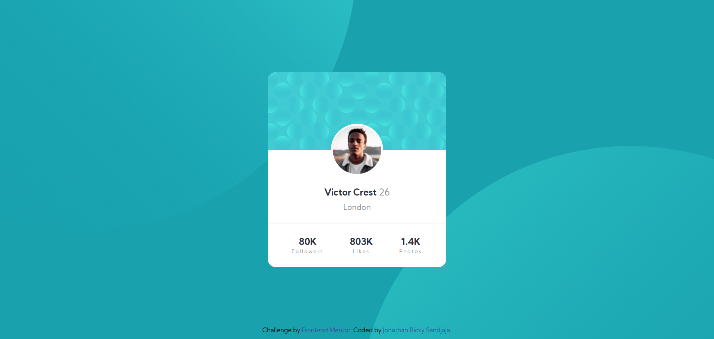

# Frontend Mentor - Profile card component solution

This is a solution to the [Profile card component challenge on Frontend Mentor](https://www.frontendmentor.io/challenges/profile-card-component-cfArpWshJ). Frontend Mentor challenges help you improve your coding skills by building realistic projects. 

## Table of contents

- [Overview](#overview)
  - [The challenge](#the-challenge)
  - [Screenshot](#screenshot)
  - [Links](#links)
- [My process](#my-process)
  - [Built with](#built-with)
  - [What I learned](#what-i-learned)
  - [Useful resources](#useful-resources)
- [Author](#author)
- [Acknowledgments](#acknowledgments)

## Overview

### The challenge

- Build out the project to the designs provided

### Screenshot



### Links

- Solution URL: [My Solution](https://github.com/joricky91/Profile-Card-Component)
- Live Site URL: [My Solution's Live Site](https://joricky91-profile-card-component.netlify.app/)

## My process

### Built with

- Semantic HTML5 markup
- CSS 
- Flexbox
- Mobile-first workflow

### What I learned

I learned about z-index here. At first, I dont understand what is z-index when I first read it, but here I finally knows about it when I confused how to move the circle background behind the card component.

```
.card{
    background-color: white;
    border-radius: 15px;
    height: 380px;
    width: 350px;
    overflow: hidden;
    display: flex;
    flex-direction: column;
    z-index: 10;
}
```

### Useful resources

- [Coding Room's Youtube Channel](https://www.youtube.com/watch?v=FhkQh7YGxVc) - This helped me for understanding and implementing the z-index property on the card component. Also, this channel's solution help me to structure the HTML because I'm a bit confused when stucturing the HTML for the card component.

## Author

- Frontend Mentor - [https://www.frontendmentor.io/profile/joricky91]
- Twitter - [https://twitter.com/joricky91]

## Acknowledgments

Special thanks for Coding Room's Youtube Channel for the solution that helped me very much. I really recommend you view the channel if you stuck in this project.


